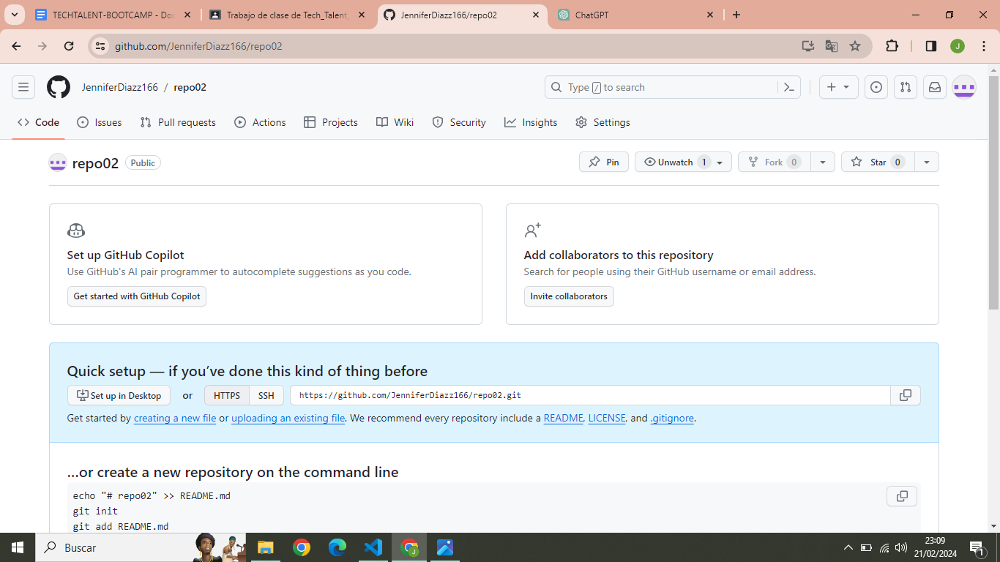
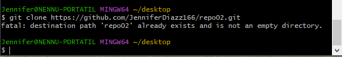
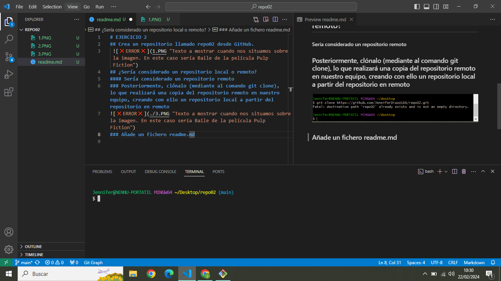

# EJERCICIO 2
## 1. Crea un repositorio llamado repo02 desde GitHub.
 
## 2. ¿Sería considerado un repositorio local o remoto?
#### Sería considerado un repositorio remoto
### 3. Posteriormente, clónalo (mediante al comando git clone), lo que realizará una copia del repositorio remoto en nuestro equipo, creando con ello un repositorio local a partir del repositorio en remoto

### Añade un fichero readme.md

